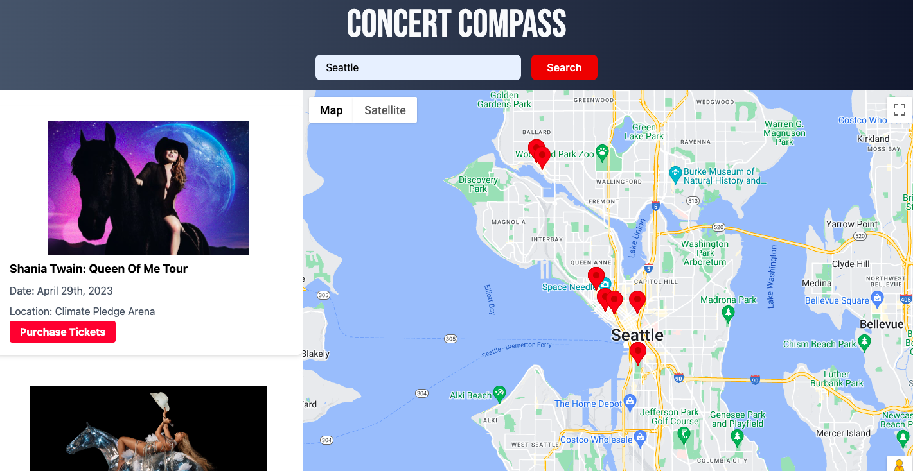

# Concert Compass

A concert finder powered by:

- Tailwind CSS
- Google Maps API
- Ticketmaster API

[This is an external link to Concert Compass](https://CH3RNAND3Z.github.io/Concert-Compass/)

## Description

We were motivated to create Concert Compass because we feel it is difficult to quickly find upcoming concerts, their locations, and other ancillary information.

When using Concert Compass, you'll find:

- a responsive search function that populates a search column with upcoming events
- links that take you to a ticket purchasing page
- an interactive map with markers based on venue location
- modals with venue information (when a marker is clicked)

## Installation

N/A

## Usage

To enjoy this site, type in your city of interest into the search bar. Once the search button is clicked, a search results column will populate with upcoming events -- within each result, a link to purchase tickets. A map will also populate showing markers based on the location of the events' venues. When a marker is clicked, a modal pops up with detailed venue information. Refreshing the page populates with your last city searched. Enjoy the show!

Future updates will allow for more search parameters.

## Credits

Concert Compass was built collaboratively by pchandler858, CH3RNAND3Z, Cxxrupt and rhodemc.

## License

Please refer to the LICENSE in the repo.
